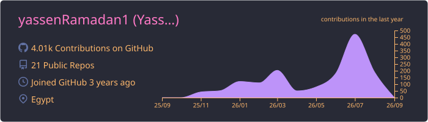
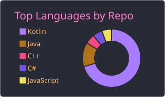
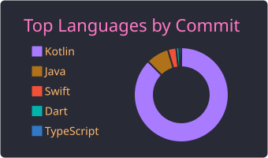
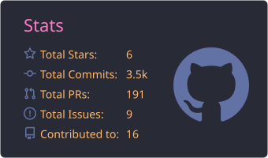
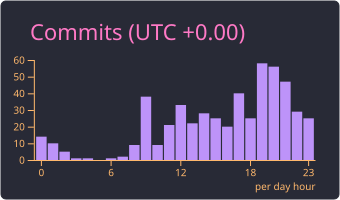

<h1 align="center">
  
</h1>

   
  
   
  
  

---

### 👨💻 About Me

- 🔭 Currently delivering Android and Flutter applications across e-commerce and industrial B2B domains.
- 🌱 Exploring advanced Jetpack Compose, Compose Multiplatform (KMP), and Agentic tooling.
- 👯 Open to collaborating on innovative mobile and open-source projects.
- 🏆 Maintainer of **AAY-Chart** (660+ GitHub stars), a Compose Multiplatform (KMP) charting library.
- 🥅 Goal: Build scalable real-world mobile applications and explore Clean Architecture & AI integrations.
- 💬 Ask me about Android Development, Kotlin, Jetpack Compose, and architectural patterns.
- 📫 Connect with me on [LinkedIn](https://www.linkedin.com/in/yassen-ramadan-hassan/).
- 📄 Check out my resume: [Yassen_Ramadan_cv.pdf](./Yassen_Ramadan_cv.pdf)
- ⚡ Fun Fact: I love solving complex platform constraints, from Canvas rendering to industrial scanning pipelines!

---

### 🛠️ Languages and Tools

#### Languages

  
  
  
  

#### Frameworks & Libraries

  
  
  
  

#### Tools & Architecture

  
  
  
  

---

### 📊 GitHub Stats

  

  

---
